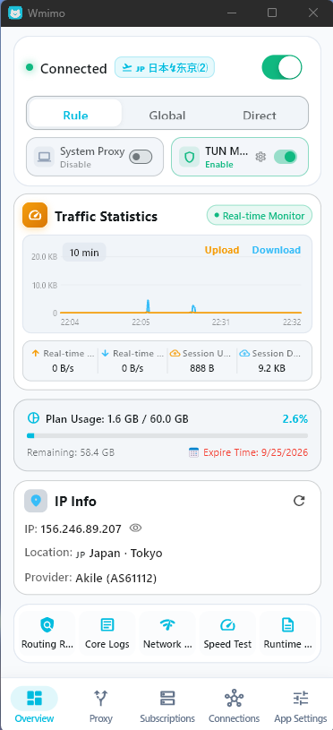

# Wmimo

[**简体中文**](README.zh-CN.md) | [**English**](README.md) | [**繁體中文**](README.zh-TW.md) | [**日本語**](README.ja.md) | [**한국어**](README.ko.md) | [**Русский**](README.ru.md) | [**Español**](README.es.md) | [**العربية**](README.ar.md) | [**فارسی**](README.fa.md)

---

  
  <h3>عميل بروكسي حديث متعدد المنصات لـ Clash / Mihomo بواجهة رسومية</h3>
  
تم بناؤه باستخدام Flutter ونواة Mihomo لتقديم تجربة وكيل سريعة وأنيقة وقوية.

  

    
    
    
    
  

   
  
   
  <em>✨ واجهة عصرية ببطاقات مصغرة 18px، مراقبة حركة المرور في الوقت الفعلي وأدوات تشخيص الشبكة</em>

---

## 📌 دعم المنصات وتوزيعات Linux

| المنصة | الحالة | التنسيقات المدعومة | الوصف |
| :--- | :---: | :--- | :--- |
| 🪟 **Windows** | ✅ **جاهز** | مثبت (`.exe`) ومحمول (`.zip`) | شريط جانبي، قائمة شريط المهام، رسم بياني للسرعة، وضع TUN، تحديث تلقائي. |
| 🐧 **Linux** | ✅ **جاهز** | AppImage (`.AppImage`), Debian (`.deb`), RPM (`.rpm`), Portable (`.tar.gz`) | واجهة GTK3 أصلية، تكامل شريط المهام، نواة Mihomo مدمجة. |
| 📱 **Android** | ✅ **جاهز** | APK شامل و APK مقسم حسب المعمارية | تكامل VpnService، توقيع Release دائم، واجهة هاتف مضغوطة. |
| 🍎 **macOS** | 🚧 **قيد التطوير** | مثبت DMG | جاري تكييف بنية NetworkExtension. |
| 🍏 **iOS** | 🚧 **قيد التطوير** | IPA | جاري دمج إطار عمل NetworkExtension. |

---

## 💖 التبرع والدعم

- **العملة (Token)**: `USDT`
- **الشبكة (Network)**: `APTOS`
- **العنوان (Address)**: `0xce0c3a1d7d8547eb7effd887095da438b89e3edd70e7c7e7927c244c2dd7f345`

---

## 📄 الترخيص

هذا المشروع مرخص بموجب رخصة **GPL-3.0**. راجع ملف [LICENSE](LICENSE).
