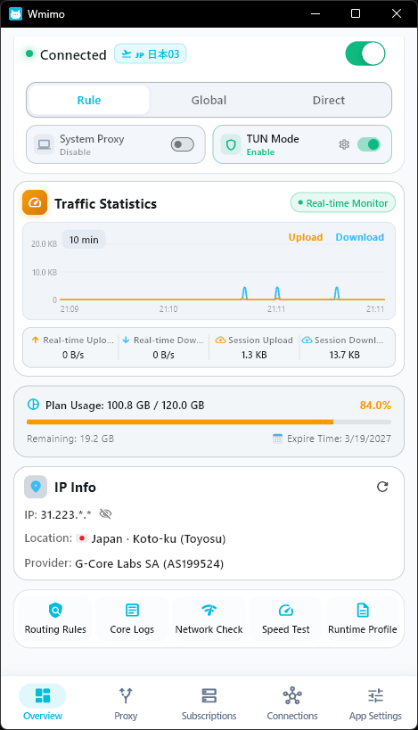

# Wmimo

[**简体中文**](README.zh-CN.md) | [**English**](README.md) | [**繁體中文**](README.zh-TW.md) | [**日本語**](README.ja.md) | [**한국어**](README.ko.md) | [**Русский**](README.ru.md) | [**Español**](README.es.md) | [**العربية**](README.ar.md) | [**فارسی**](README.fa.md)

---

  
  <h3>Cliente GUI de proxy moderno y multiplataforma para Clash / Mihomo</h3>
  
Desarrollado con Flutter y el núcleo Mihomo, ofreciendo una experiencia de proxy ultrarrápida, elegante y potente.

  

    
    
    
    
    
  

   
  
   
  <em>✨ Diseño moderno de micro-tarjetas de 18px, monitoreo de tráfico en tiempo real y herramientas de diagnóstico</em>

---

## 📌 Matriz de soporte de plataformas y Linux

| Plataforma | Estado | Formatos soportados | Descripción |
| :--- | :---: | :--- | :--- |
| 🪟 **Windows** | ✅ **Listo para producción** | Instalador (`.exe`) y Portable (`.zip`) | Barra lateral, menú de bandeja del sistema, gráfico de velocidad en tiempo real, modo TUN, autoactualización. |
| 🐧 **Linux** | ✅ **Listo** | AppImage (`.AppImage`), Debian (`.deb`), RPM (`.rpm`), Portable (`.tar.gz`) | Interfaz GTK3 nativa, soporte de bandeja del sistema, núcleo Mihomo integrado. |
| 📱 **Android** | ✅ **Listo** | APK Universal y APKs por ABI | Integración VpnService, firma Release permanente, interfaz móvil compacta. |
| 🍎 **macOS** | 🛠️ **Código listo** | DMG / Compilación local | Proxy del sistema y modo TUN implementados en código. Admite compilación local (`flutter run -d macos`); no se distribuyen DMG precompilados en Release. |
| 🍏 **iOS** | 📦 **Estructura lista** | IPA / Código fuente | Arquitectura NetworkExtension integrada. No se distribuyen paquetes IPA oficiales debido a requisitos de certificados de Apple. |

> 💡 **Política de distribución**: El CI/CD oficial se centra en distribuir paquetes para **Windows**, **Linux** y **Android**. El código fuente de macOS e iOS está listo, pero no se distribuyen binarios precompilados en Releases.

---

## 📬 Contacto con el autor y reporte de errores

Si encuentra algún error, fallo o tiene sugerencias de mejora, póngase en contacto con el autor:

- 💬 **Telegram**: [t.me/wmimoapp](https://t.me/wmimoapp)
- 📧 **Correo del autor**: [aisaniya@proton.me](mailto:aisaniya@proton.me)
- 🐛 **GitHub Issues**: [Enviar un Issue](https://github.com/aimy1/Wmimo/issues)

---

## 📄 Licencia

Este proyecto está bajo la licencia **GPL-3.0**. Consulte el archivo [LICENSE](LICENSE).
